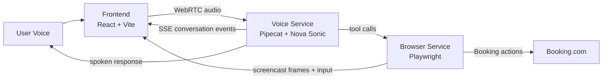

<p align="center">
  
</p>

<h1 align="center">Booking Voice AI</h1>

<p align="center">
  A hackathon demo for voice-first hotel search and reservation on Booking.com
  using Amazon Nova Sonic, Pipecat, and Playwright.
</p>

<p align="center">
  
  
  
  
  
</p>

---

## Overview

This project turns hotel booking into a voice conversation.

The user speaks naturally. The assistant listens through WebRTC, understands the request with Amazon Nova Sonic, operates Booking.com in a persistent Playwright session, and shows the whole journey in a live screencast UI.

It is intentionally tuned for a smooth demo:
- quick search and refinement in the same session
- short spoken responses
- visible browser automation
- guided transition from search to reservation to form filling

## Demo Highlights

<table>
  <tr>
    <td width="33%">
      <strong>Voice Search</strong><br/>
      Ask for destination, dates, adults, children, child ages, and rooms in natural language.
    </td>
    <td width="33%">
      <strong>Live Browser</strong><br/>
      Watch Booking.com update in real time while the assistant clicks, scrolls, and opens hotel details.
    </td>
    <td width="33%">
      <strong>Reservation Flow</strong><br/>
      Move from hotel detail to booking form, fill guest info, and continue toward payment.
    </td>
  </tr>
</table>

## Current Flow

The active demo supports:

1. Search hotels by:
   - destination
   - check-in / check-out dates
   - adults
   - children
   - child ages
   - rooms
2. Refine the current search without opening a new browser session.
3. Open a selected hotel detail page.
4. Start the reservation flow only when the user explicitly asks to book.
5. Fill guest information on the visible booking form.
6. Ask about remaining optional fields or choices.
7. Continue to the next booking step when the user explicitly says to proceed.

## Architecture



### Services

| Service | Port | Responsibility |
|---|---:|---|
| `frontend` | `5173` | UI, microphone capture, screencast viewer, conversation panel |
| `main_voice.py` | `7860` | WebRTC, Nova Sonic pipeline, tool orchestration, SSE |
| `main_browser_service.py` | `7863` | Persistent Playwright session, Booking.com actions, browser WebSocket |

### Active Code Paths

- `src/voice_bot.py`: live voice pipeline and tool bridge
- `src/prompts.py`: system prompt and demo behavior rules
- `src/playwright_agent.py`: Booking.com automation
- `frontend/src/App.tsx`: UI, conversation stream, screencast, remote input

Legacy note:

- `src/browser_agent.py` is legacy/inactive and is not part of the current demo path.

## Stack

| Layer | Tech |
|---|---|
| Voice | Amazon Nova Sonic |
| Realtime transport | Pipecat + SmallWebRTC |
| Browser automation | Playwright |
| Backend | Python + aiohttp |
| Frontend | React + Vite + TypeScript |
| UI events | SSE |
| Browser video | CDP screencast over WebSocket |

## Quick Start

### 1. Create the Python environment

```powershell
python -m venv .venv
.venv\Scripts\activate
pip install -r requirements.txt
python -m playwright install chromium
```

### 2. Install frontend dependencies

```powershell
cd frontend
npm install
cd ..
```

### 3. Configure `.env`

Copy `.env.example` to `.env`, then set at least:

```env
AWS_ACCESS_KEY_ID=...
AWS_SECRET_ACCESS_KEY=...
AWS_SESSION_TOKEN=

NOVA_SONIC_REGION=us-east-1
NOVA_SONIC_MODEL_ID=amazon.nova-2-sonic-v1:0

BROWSER_SERVICE_URL=http://localhost:7863
HOST=0.0.0.0
PORT=7860
BROWSER_PORT=7863

LOG_LEVEL=INFO
```

Notes:
- `AWS_SESSION_TOKEN` is optional unless you use temporary credentials.
- `NOVA_SONIC_REGION` defaults to `us-east-1`.
- `NOVA_SONIC_MODEL_ID` defaults to `amazon.nova-2-sonic-v1:0`.
- the voice service uses a Google STUN server in code by default

### 4. Run the three services

In three separate terminals:

```powershell
# Terminal 1
.venv\Scripts\activate
python main_browser_service.py
```

```powershell
# Terminal 2
.venv\Scripts\activate
python main_voice.py
```

```powershell
# Terminal 3
cd frontend
npm run dev
```

Open:

`http://localhost:5173`

## Hackathon Demo Script

If you want a clean judge-facing demo, this path works well:

### Search

> "I want a hotel in Paris from April 15 to April 20 for 2 adults."

### Refine

> "Add 1 child, age 9."  
> "Change it to 2 rooms."

### Inspect

> "Open the first hotel."

### Reserve

> "Book this hotel."

### Fill form

> "Full name Wilson Joy, email wilson@gmail.com, region Vietnam, phone 0123456789."

### Continue

> "Continue to payment."

## Endpoints

### Voice service

- `POST /offer`
- `PATCH /offer`
- `GET /events`
- `GET /health`
- `GET /screenshot`

### Browser service

- `POST /api/execute`
- `GET /api/health`
- `GET /screenshot`
- `GET /ws/browser`

### Frontend proxy behavior

The Vite dev server proxies:

- `/offer`
- `/events`
- `/screenshot`
- `/health`
- `/api/*`

to the voice service, while the browser screencast uses `/ws/browser`.

## Validation

Useful local checks:

```powershell
python -m py_compile src\voice_bot.py src\playwright_agent.py src\prompts.py
python -m py_compile tests\test_api.py tests\test_playwright.py
cd frontend
node node_modules\typescript\bin\tsc -b
```

Smoke tests live in:

- `tests/test_api.py`
- `tests/test_playwright.py`

## Known Limitations

- This is a demo-first system, not a production booking platform.
- Booking.com markup can change and break selectors.
- The browser runs headless, so all visual feedback depends on the screencast.
- The voice logic uses stricter intent guards to keep the demo stable.
- A `Dockerfile` and `docker-compose.yml` exist, but the maintained flow is the local 3-process setup above.

## Repository Layout

```text
.
|-- frontend/
|   |-- public/logo.png
|   |-- src/App.tsx
|   `-- vite.config.ts
|-- src/
|   |-- playwright_agent.py
|   |-- prompts.py
|   |-- voice_bot.py
|   `-- browser_agent.py   # legacy
|-- tests/
|   |-- test_api.py
|   `-- test_playwright.py
|-- main_browser_service.py
|-- main_voice.py
|-- requirements.txt
`-- .env.example
```

---

<p align="center">
  Built for a live Booking.com voice booking demo.
</p>
